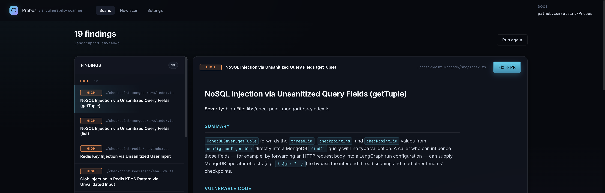

# probus

> Open-source AI vulnerability scanner powered by open models.

[](https://www.npmjs.com/package/probus)
[](https://www.npmjs.com/package/probus)
[](./LICENSE)
[](.nvmrc)
[](https://github.com/ItayRosen/Probus/actions/workflows/ci.yml)



---

Probus started as an internal supply chain security scanning tool that proved itself extremely efficient by finding vulnerabilities in top open source packages (e.g. n8n, AI sdk, langraphjs and more). It is now open-source to help developers better secure their codebase & supply chain. Probus' edge lies in its ability to scale its scanning capabilities with open models (by using OpenRouter).

## What it does

Probus harnesses 3 agents that:

- [Analyst] Analyze the codebase and pick key files for deep scanning (e.g. entry points, third-party surface, dangerous sinks).
- [Researcher] Scan each file, dig through its chains of calls, and write raw findings (potential vulnerabilities).
- [QA] Independently verify each finding, make sure it has a real attack vector, and write a report.

## Quick start

```bash
npm install -g probus
probus
```

`probus` launches a local web server, opens your browser to it, and from there you:

- pick a repo to scan,
- enter / pick a model-provider API key,
- watch a live dashboard of the analyst → researcher → QA pipeline,
- and browse verified findings as polished markdown reports.

No CLI flags, no scan/view subcommands — everything happens on the page. The only options are launcher flags:

```text
probus [--port <N>] [--no-open]
```

| Flag         | Default | What it does                                          |
| ------------ | ------- | ----------------------------------------------------- |
| `--port`     | random  | Pin the local server port (otherwise picks a free one) |
| `--no-open`  | open    | Skip auto-opening the browser; just print the URL      |

## Model providers

Probus runs most (cost) effectively with open models using [OpenRouter](https://openrouter.ai). It is still possible however to use other providers, such as [OpenAI](https://openai.com) or [Anthropic](https://anthropic.com), albeit with higher costs.

You configure providers and keys directly in the web UI's **Settings** tab (or inline on the **New scan** screen). Keys are stored at `~/.probus/.env` (chmod 600) and never leave the machine.

### Defaults per provider

When you don't pass model overrides, these are the picks:

| Provider     | Primary default                | Secondary default                     |
| ------------ | ------------------------------ | ------------------------------------- |
| `openrouter` | `openrouter/qwen/qwen3.6-plus` | `openrouter/deepseek/deepseek-v4-pro` |
| `openai`     | `openai/gpt-5.4-mini`          | `openai/gpt-5.4`                      |
| `anthropic`  | `anthropic/claude-sonnet-4-6`  | `anthropic/claude-opus-4-7`           |

### Effort levels

Each scan picks an effort level that caps the number of files the analyst targets:

| Effort     | Files (approx) |
| ---------- | -------------- |
| `low`      | 50             |
| `medium`   | 100            |
| `high`     | 500            |

## Cost

Probus splits work between two models so you only pay premium rates where it matters:

- **Primary** (~90% of tokens) — runs on every file. Pick something cheap and fast: `qwen3.6`, `gpt-5.4-mini`, `sonnet-4.6`.
- **Secondary** (~10% of tokens) — verifies findings. Pick something smarter: `deepseek-v4-pro`, `gpt-5.4`, `opus-4.7`.

Each file consumes roughly **1M input tokens**. Approximate per-file cost by provider:

| Provider                   | Cost / file | vs. open models |
| -------------------------- | ----------- | --------------- |
| `openrouter` (open models) | ~$0.50      | 1× (baseline)   |
| `openai`                   | ~$1.25      | ~2.5×           |
| `anthropic`                | ~$5.00      | ~10×            |

## Contributing

PRs welcome. See [CONTRIBUTING.md](./CONTRIBUTING.md) for dev setup, scripts, and conventions.

## Development

### Local dev

```bash
git clone https://github.com/ItayRosen/Probus
cd probus
nvm use && npm install
npm run build:web    # build the React UI once (re-run on web/ changes)
npm run dev          # tsx-runs the server; opens browser to localhost:PORT
```

For UI iteration with HMR:

```bash
PROBUS_PORT=9091 npm run dev   # backend on pinned port :9091
npm run dev:web                # in another terminal — Vite on :5173 with HMR, proxies /api → :9091
```

### Architecture

```
┌────────────┐   files[]   ┌──────────────┐  findings[]  ┌───────────┐
│  Analyst   │────────────▶│   Primary    │─────────────▶│ Secondary │
│  (1 call)  │             │  (per file)  │              │ (per file)│
└────────────┘             └──────────────┘              └─────┬─────┘
                                                               │
                                                               ▼
                                                       reports/*.md
```

All three run as isolated `query()` sessions through the Claude Agent SDK, each with its own filesystem sandbox scoped to the repo being scanned.

### Output layout

```
output/<repo-slug>/
├── analysis.json           # file list picked by the analyst
├── findings/
│   └── src__foo__bar.ts.json   # per-file findings (verified + unverified)
├── reports/
│   └── src__foo__bar.ts--1.md  # one Markdown report per verified finding
├── debug/
│   └── src__foo__bar.ts.log    # full agent transcript per file
└── processed-files.txt     # cache so reruns skip finished files
```

`<repo-slug>` is `<basename>-<sha1(abspath)[:8]>` so the same repo never collides with another.

## License

Apache 2.0 — see [LICENSE](./LICENSE).
